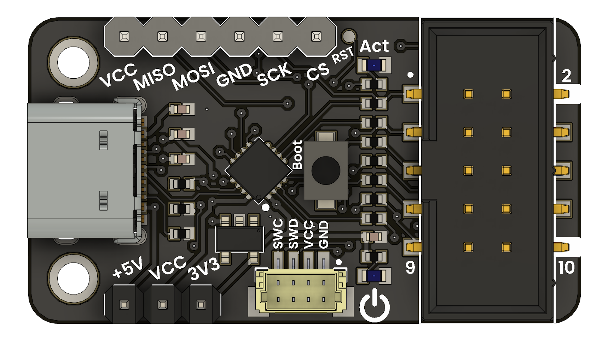

# CH55x-FPGA Programmer Firmware  
**USB-Blaster Protocol Emulation for CH552G (Intel Quartus Compatible)**

This repository contains firmware for **CH552G** microcontrollers that emulates the **Intel/Altera USB-Blaster** JTAG protocol, enabling FPGA programming and debugging with **Intel Quartus tools**. The implementation supports seamless operation on **Linux** and **Windows** without requiring proprietary drivers.



The project builds on [Vladimir Duan’s CH55x-USB-Blaster](https://github.com/VladimirDuan/CH55x-USB-Blaster), with significant updates to improve **safety**, **portability**, and **code structure**, including a clean **GPIO abstraction layer**.

---

## Key Features

- **Quartus-compatible**: Works with Intel Quartus Programmer (JTAG).
- **Fully runs on CH552G**: Compatible with cost-effective clone boards.
- **Safe VID/PID**: Default configuration avoids proprietary USB identifiers.
- **Optional compatibility mode**: Emulates Intel USB-Blaster device signature if needed.
- **Linux native support**: No driver installation required.
- **Abstracted GPIO layer**: `gpio_wrapper.h` simplifies hardware pin definitions.

---

## USB VID/PID Configuration

The firmware provides a compile-time switch to toggle between **safe distribution mode** and **Quartus-compatible emulation**:

```c
#define USE_COMPATIBLE_VIDPID     0  // Set to 1 to enable Intel VID/PID (not recommended for distribution)
#define USE_COMPATIBLE_STRINGS    0  // Set to 1 for full USB-Blaster descriptor emulation
```

| Mode                   | VID      | PID     | Quartus Recognized | Distribution Safe |
|------------------------|----------|---------|--------------------|-------------------|
| **Compatibility Mode** | `0x09FB` | `0x6001`| Yes                | No                |
| **Safe/libusb Mode**   | `0x16C0` | `0x05DC`| Manual select      | Yes               |

- **`USE_COMPATIBLE_VIDPID = 1`**: Emulates Intel USB-Blaster for plug-and-play with Quartus.
- **`USE_COMPATIBLE_VIDPID = 0`**: Uses shared libusb-safe VID/PID (`Van Ooijen`). Recommended for public firmware sharing.

---

## Build Instructions

### Prerequisites

- [SDCC Compiler](https://sdcc.sourceforge.net/)
- [CH554 SDCC SDK](https://github.com/Blinkinlabs/ch554_sdcc)
- GNU Make

### Steps

```bash
git clone https://github.com/your-username/ch55x-fpga-programmer.git
cd ch55x-fpga-programmer
make
```

This will produce a `main.ihx` and `main.bin` firmware image.

### Flashing

You can flash the firmware using the **WCH USB bootloader** or the provided `chprog.py` script.

```bash
# Example using Python-based chprog.py:
python3 tools/chprog.py main.bin
```

Ensure the device is in **bootloader mode** (press and hold BOOT while connecting USB).

---

## Hardware Compatibility

Tested with clone boards labeled **"Rev. C"** using the **CH552G** MCU. In safe mode, the device enumerates as:

```
Bus 001 Device XXX: ID 16c0:05dc Van Ooijen Technische Informatica shared ID
```

- USB-Blaster functionality is recognized by **Quartus Programmer**
- No driver needed on Linux; use **Zadig** on Windows (optional)

---

## License

**MIT License**  
See [LICENSE](LICENSE) for full text.

---

## Acknowledgements

- Original USB-Blaster Firmware: [Vladimir Duan](https://github.com/VladimirDuan/CH55x-USB-Blaster)
- CH55x SDK: [Blinkinlabs](https://github.com/Blinkinlabs/ch554_sdcc)
- Background article: [Fixing a Knockoff Altera USB Blaster](https://www.downtowndougbrown.com/2024/06/fixing-a-knockoff-altera-usb-blaster-that-never-worked/)
