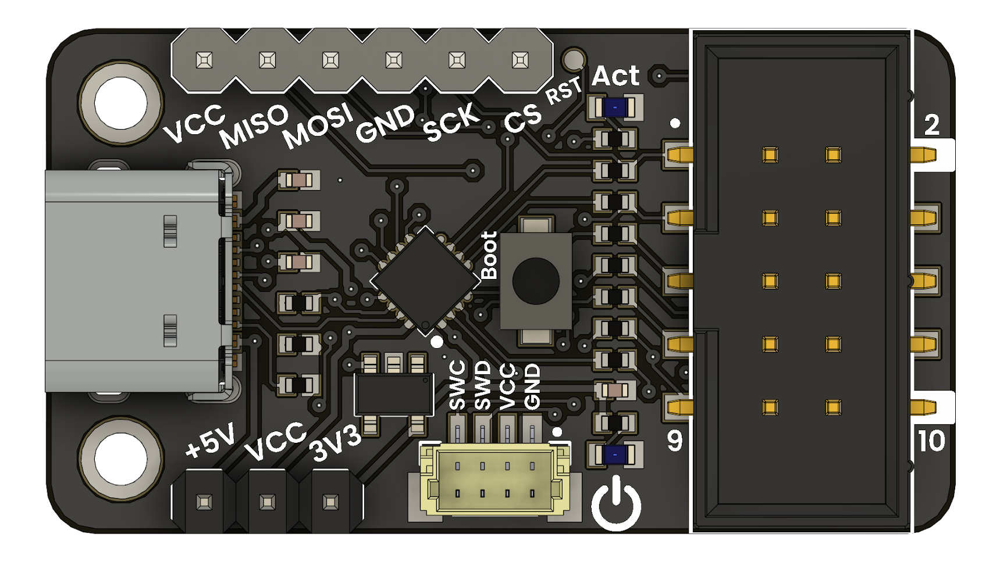

# PicoAVR Programmer — Technical Overview with `spkg` Support

The **PicoAVR Programmer** project builds upon the foundational firmware developed by **Stefan Warner** and extends it with enhanced compatibility for automated workflows via the `spkg` (small package) tool. This programmer supports both traditional **Makefile-based** compilation and deployment, as well as **Docker-based** containerized development environments.




## Supported Development Workflows

### 1. **Native Toolchain (Makefile-Based)**
Ideal for users familiar with command-line environments and the SDCC toolchain. This method provides fine-grained control over compilation, linking, and flashing.

- Requires installation of:
  - **SDCC** (Small Device C Compiler)
  - **Python 3**
  - `pyusb` for USB communication

### 2. **Dockerized Toolchain**
Recommended for users seeking a portable and consistent environment without setting up the toolchain manually. Docker ensures dependency isolation and platform independence.

## Flashing Firmware to CH55x
Firmware deployment uses the **CH55x USB bootloader**, which facilitates USB-based flashing via tools like `chprog.py`. The device must be manually placed in **bootloader mode** using the hardware BOOT button.

- **Windows:** Use [WCHISPTools](http://www.wch.cn) or Zadig to install appropriate USB drivers.
- **Linux/macOS:** Use the provided `tools/chprog.py` script. Ensure correct `udev` rules are applied for USB access.

---

## Bootloader Setup

### CH55x USB Bootloader Mode Activation
To enter bootloader mode:

1. Disconnect power and USB from the device.
2. Hold the **BOOT** button.
3. Connect the board to USB while holding BOOT.
4. Release BOOT once the device is powered. The bootloader will remain active for a few seconds.

### USB Permission Setup (Linux)
Create a `udev` rule for unrestricted USB access:

```bash
echo 'SUBSYSTEM=="usb", ATTR{idVendor}=="4348", ATTR{idProduct}=="55e0", MODE="666"' | sudo tee /etc/udev/rules.d/99-ch55x.rules
sudo udevadm control --reload
sudo udevadm trigger
```

---

## Native Toolchain Setup

### Dependencies (Linux/Debian)

```bash
sudo apt install build-essential sdcc python3 python3-pip
pip3 install pyusb
```

### Compiling and Flashing

```bash
make flash     # Compile and flash firmware using makefile
# OR
python3 tools/chprog.py picoavr.bin  # Flash precompiled binary
```

Ensure the CH55x is in bootloader mode before flashing.

---

## Windows Driver Setup for picoAVR

- The picoAVR includes **Windows Compatible ID (WCID)** descriptors for automatic driver recognition.
- If needed, use [Zadig](https://zadig.akeo.ie/):
  - Select `USBasp`, install `libusbK`.
  - Then select `SerialUPDI`, install CDC (USB-Serial) driver.

---

## Device Operation

- Use the onboard voltage selector to choose **3.3V** or **5V** programming.
- Upon USB connection, the device enumerates as:
  - `USBasp` interface
  - Additional **CDC COM port** for UPDI communication
- Supports:
  - 6-pin **ICSP** connector
  - 3-pin **Serial UPDI** connector

The picoAVR is compatible with any programming environment that supports **USBasp** or **Serial UPDI** interfaces.

---

## Resources and References

| Resource | Description |
|---------|-------------|
| [CH552 Datasheet](http://www.wch-ic.com/downloads/CH552DS1_PDF.html) | MCU reference |
| [SDCC Compiler](https://sdcc.sourceforge.net/) | Required C compiler |
| [CH55x SDK for SDCC](https://github.com/Blinkinlabs/ch554_sdcc) | SDCC-compatible SDK |
| [USBasp Programmer by Fischl](https://www.fischl.de/usbasp/) | Firmware reference |
| [CH55xduino](https://github.com/DeqingSun/ch55xduino) | Arduino-compatible CH55x toolset |
| [EasyEDA Project Files](https://oshwlab.com/wagiminator) | Schematic and PCB design |


---

## License

This project is licensed under the [Creative Commons Attribution-ShareAlike 3.0 Unported License](http://creativecommons.org/licenses/by-sa/3.0/).


